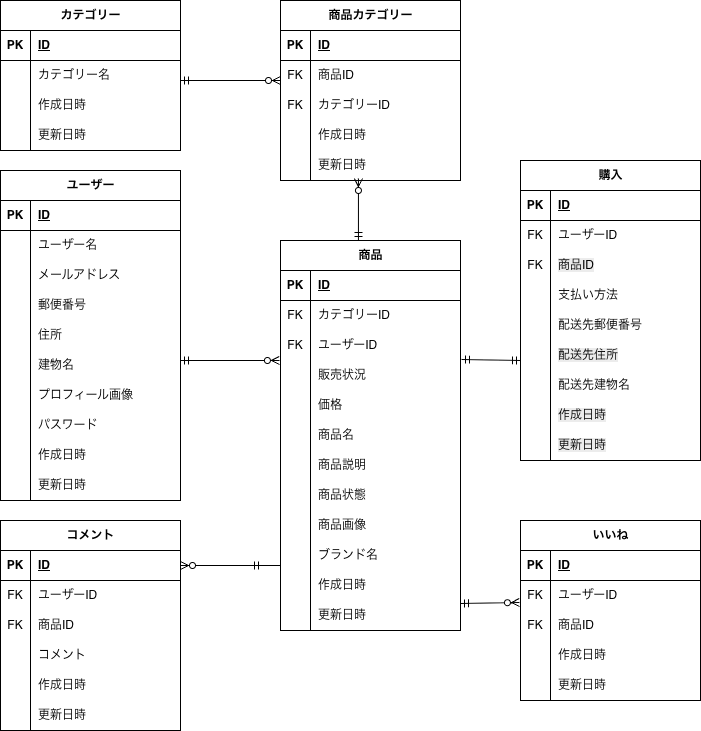

#　アプリケーション名
FleaMarketApp

## 環境構築
### Dockerビルド
git clone git@github.com:miho-study/flea-market-site.git
docker compose up -d build

### Laravel環境構築
docker-compose exec php bash
composer install
cp .env.example .env、環境変数の変更
php artisan key:generate
php artisan generate
php artisan db:seed

## 使用技術(実行環境)
PHP 8.4.1
Laravel 8.83.29
MySQL  8.0.43
nginx 1.21.1

## ER図

## URL
お問い合わせ画面:http://localhost/
ユーザー登録:http://localhost/register
phpmyadmin:http://localhost:8080/

## 補足
使用しているテストユーザ
テストユーザー１
名前 miho
メールアドレス miho@test
パスワード 00000000

テストユーザー２
名前 miho1
メールアドレス miho@test1
パスワード 00000000